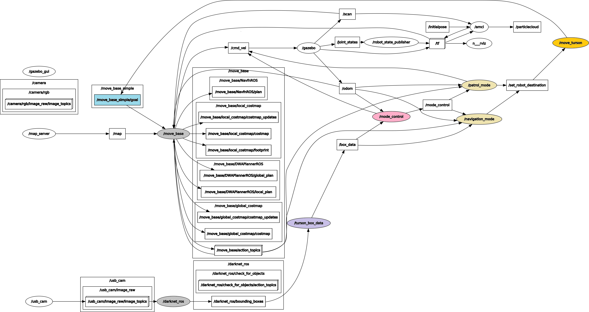

# [19/20 Capstone Project] TURSON Project

   

TURSON Project
=====================

# 1. TURSON Project

## 1.0. Introduction
2019~2020 캡스톤 디자인 프로젝트 '자율 안전보조로봇'을 제어하기 위한 ROS 코드입니다.

|Develop environment||
|------|------|
|OS|Ubuntu 16.04|
|ROS|kinetic|
|Languae|python 2.7|
|MCU|OpenCR, Nvidia Jetson Tx2|
|Robot|Turtlebot3_waffle|

아래의 내용이 전부 실행가능함을 전제로 합니다.  
1.[Turtlebot e-Manual](http://emanual.robotis.com/docs/en/platform/turtlebot3/overview/)    
2.[Darknet ROS](https://github.com/ingjae/darknet_ros_jetson_tx2)

---
## 1.1. 영상 
### 1.1.1. 자율안전 로봇 시뮬레이션

### 1.1.2. Gmapping test
 
### 1.1.3. Navigation test
 

- - -
## 1.2. Package 설명
### 1.2.1 Rqt graph of mode control
Node 실행시 만들어지는 rqt graph입니다.

### 1.2.2 구조 설명

|Name | Description|
|------|------|
|init_pose.py|프로그램 시작시 2D Estimate 과정을 코드화|
|mode_control.py|로봇의 Person detection 값을 기반으로 적절한 모드값 변경|
|move_turson.py|이동명령을 수행하는 노드|
|navigation_mode.py|특정 구역 이내로 들어온 사람에게 접근제한 임무를 수행토록 목적지 지정|
|patrol_mode.py|순찰지역을 순환하면서 주변지역을 스캔하는 임무|
|turson_box_data.py|순찰 혹은 Navigation 임무를 수행하면서 Person detection 값을 수신하고 필요한 노드로 값을 전달|

### 1.2.3 실행 방법
#### 1.2.3.1 roslaunch 실행방법
[update] roslaunch 명령어로 기존의 실행방법을 간소화했습니다.
>[1번 터미널] roslaunch turson turson.launch  

>[2번 터미널] roslaunch turson mode.launch  

>[3번 터미널] roslaunch darknet_ros darknet_ros.launch

