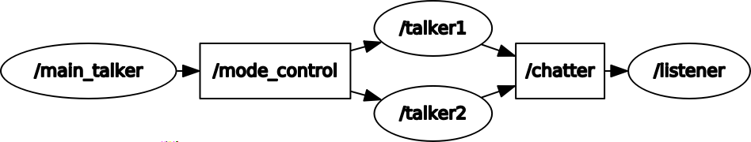
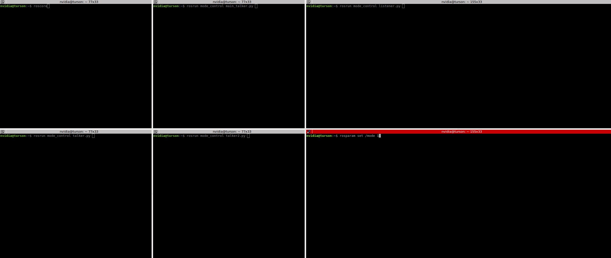
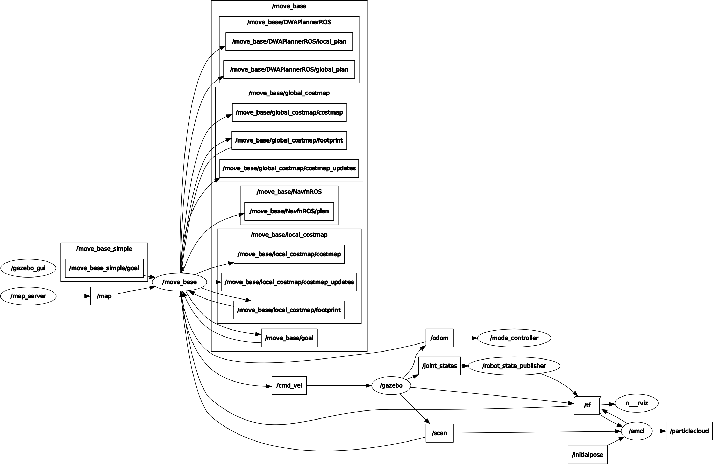
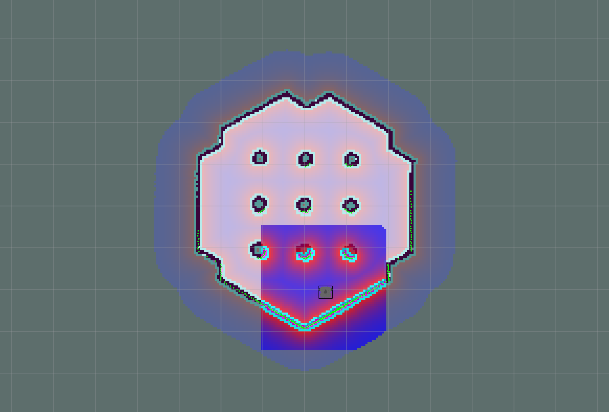

   

Mode_control node
=====================

# 1. Mode_control package sample

## 1.0. Develop environment summary
|Develop environment||
|------|------|
|OS|Ubuntu 16.04|
|ROS|kinetic|
|Languae|python|
|MCU|OpenCR, Nvidia Jetson Tx2|
|Robot|Turtlebot3_burger|

* [Turtlebot e-Manual](http://emanual.robotis.com/docs/en/platform/turtlebot3/overview/)의 내용이 전부 실행가능함을 전제로 합니다.

## 1.1. Mode_control package sample
2019~2020 캡스톤 디자인 프로젝트 '자율 안전보조로봇'의 동작모드를 제어하기 위한  ROS 예제 코드 입니다.
파이썬 파일의 위치는 다음과 같습니다.
```
mode_control/scripts/Mode_control_sample
```

- - -
## 1.2. Package 설명
### 1.2.1 Rqt graph of mode control
Node 실행시 만들어지는 rqt graph입니다.



### 1.2.2 구조 설명


|Node | Description|
|------|------|
|main_talker|talker1 노드 혹은 talker2노드 둘 중 어떤 노드를 실행 할지 rosparam을 통해 결정|
|talker1,talker2|mode=0면 talker1노드 실행, mode=1면 talker2노드 실행|
|listner|Mode에 따라 각각의 talker로부터 받은 문자열을 출력.|

__[보충] __

main_talker는 mode를 Publish하는 노드(Topic: /mode_control Message: Num.msg)  
Num.msg는 int64 num 으로 선언  
각각의 talker는 mode를 수신하는 서브스크라이버임과 동시에 서로 다른 문자열을 퍼블리시하는 퍼블리셔이다.


### 1.2.3 실행 방법
#### 1.2.3.1 rosrun 실행방법
각각의 명령어는 서로 다른 터미널(terminator권장)에서 실행함을 전제로 합니다.  
또한,cmake가 되었있는 것을 전제로 합니다.

>[1번 터미널] roscore  
>[2번 터미널] rosrun mode_control main_talker.py  
>[3번 터미널] rosrun mode_control talker.py  
>[4번 터미널] rosrun mode_control talker2.py  
>[5번 터미널] rosrun mode_control main_listener.py  

만약 모드 변환을 하고 싶다면, 우선 parameter가 존재여부 먼저 확인해야 합니다.
>rosparam list   

* 명령어를 수행했을 때  __/mode__ 라는 파라미터가 보여야 합니다.

모드 변환
>rosparam set /mode 0  
>rosparam set /mode 1


  

#### 1.2.3.1 roslaunch 실행방법  
다음과 같이 roslaunch로 한 줄 실행도 가능합니다.
> roslaunch mode_control mode_control_sample.launch

---
# 2. Mode_control package
## 2.0. 개요
2019~2020 캡스톤 디자인 프로젝트 '자율 안전보조로봇'의 동작모드를 제어하기 위한  ROS 실제 제어 코드 입니다.  
파이썬 파일의 위치는 다음과 같습니다.  
```
mode_control/scripts
```
* [Turtlebot e-Manual](http://emanual.robotis.com/docs/en/platform/turtlebot3/overview/)의 내용이 전부 실행가능함을 전제로 합니다.

- - -
## 2.2. Package 설명
### 2.2.1 Rqt graph of mode control
외부 노드인 initialpose를 include했을 때 Node 실행시 만들어지는 rqt graph입니다.


실행 시 자동으로 실행되는 rviz화면입니다. 별도의 2D estimate 과정 없이 
위치 초기화가 되어 있는 모습을 볼 수 있습니다.


### 2.2.2 구조 설명

로봇의 동작모드는 2가지로 구분되며, 각 모드번호에 대한 동작은 다음과 같습니다.
|Mode #| 동작|
|------|------|
|0|Patrol|
|1|Navigation|

|Node | Description|
|------|------|
|mode_controller|Patrol 모드를 수행할지 Navigation 모드를 수행할지를 결정|
|Patrol, Navigation|mode=0면 Patrol노드 실행,  mode=1면 Navigation 실행|


### 2.2.3 실행 방법
#### 2.2.3.1 roslaunch 실행방법  
* cmake가 되었있는 것을 전제로 합니다.  
* rosrun으로도 실행가능하지만 실행전 다수의 roslaunch가 실행되어야 하므로 roslaunch를 권장합니다.
* launch파일은 patrol_mode 패키지의 init_pose.py를 include하므로 patrol_mode패키지가 존재하지 않을 경우 launch 파일의 다음 부분을 주석처리하고 실행해야 합니다.

> include file="$(find patrol_mode)/launch/init_pose.launch">  
*  roslaunch 실행
> roslaunch mode_control mode_control.launch

모드 변환은 다음의 경우에 유효합니다.  
* Patrol_mode node 실행
* Navigation_mode node 실행

만약 모드 변환을 하고 싶다면, 우선 parameter가 잡히는지 확인해야 합니다.  
> rosparam list   

* 명령어를 수행했을 때 /mode라는 파라미터가 보여야 합니다.

모드 변환
>rosparam set /mode 0  
rosparam set /mode 1 