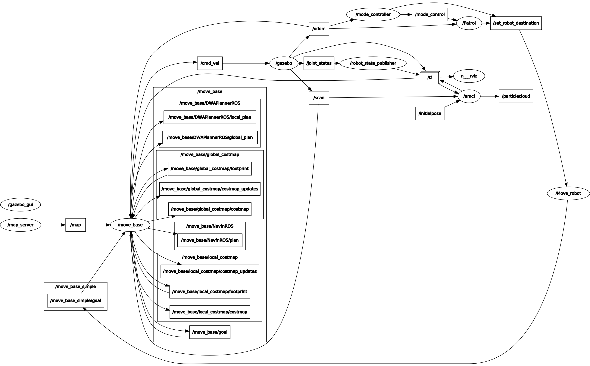
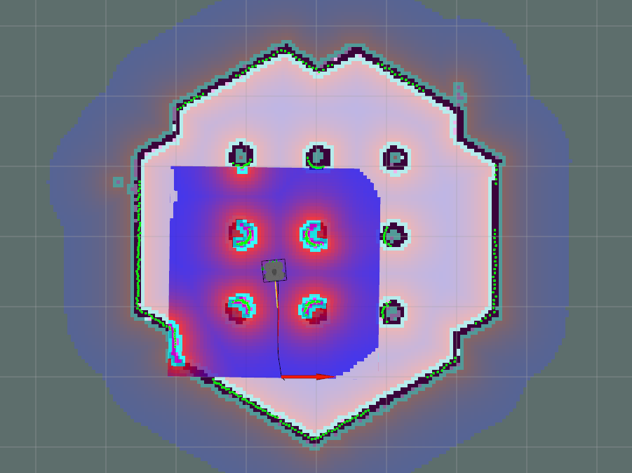

   

Patrol_mode package
=====================

# 1. Patrol_mode package
## 1.0. Develop environment summary
|Develop environment||
|------|------|
|OS|Ubuntu 16.04|
|ROS|kinetic|
|Languae|python|
|MCU|OpenCR, Nvidia Jetson Tx2|
|Robot|Turtlebot3_waffle|

## 1.1.Patrol_mode package
2019~2020 캡스톤 디자인 프로젝트 '자율 안전보조로봇'의 Patrol 모드를 수행하기 위해 작성되는 코드입니다.  
파이썬 파일의 위치는 다음과 같습니다.
```
patrol_mode/scripts/
```

__<Preliminary>__  

* [Turtlebot e-Manual](http://emanual.robotis.com/docs/en/platform/turtlebot3/overview/)의 내용이 전부 실행가능함을 전제로 합니다 
* 다음 패키지를 받아줍니다.

> git clone git@github.com:HY-HIGH/mode_control.git 

> cd ~/catkin_ws && catkin_make  


- - -
## 1.2. Package 설명
### 1.2.1 Rqt graph of Patrol package
Patrol package 실행시 만들어지는 rqt graph입니다.



### 1.2.2 구조 설명
|Node | Description|
|------|------|
|Initial_pose|map상의 시작 point 1회 publish|
|Patrol|mode=0면 노드 실행|


### 1.2.3 실행 방법

* 각각의 명령어는 서로 다른 터미널에서 실행함을 전제로 합니다.(terminator권장)  
* cmake가 되었있는 것을 전제로 합니다.  

>[1번 터미널] roslaunch mode_control mode_control.launch  
* Gazebo와 rviz가 완벽히 켜질 때까지 기다린 후 다음 명령을 실행합니다.

>[2번 터미널] roslaunch patrol_mode patrol_mode.launch   
>[3번 터미널] roslaunch patrol_mode move_robot.launch  
 

만약 모드 변환을 하고 싶다면, 우선 parameter가 잡히는지 확인해야 합니다.
>rosparam list   

* 명령어를 수행했을 때 /mode라는 파라미터가 보여야 합니다.

모드 변환
>rosparam set /mode 0  
rosparam set /mode 1

### 1.2.4 실행 
* 실행 시 다음과 같이 4 patrol point를 차례대로 순환 주행을 하게 됩니다.
* 다음 코드로 Navigation 모드 전환 시 제자리에 바로 로봇은 현재 위치에서 정지하게 됩니다.
> rosparam set /mode 1 

* 다음 코드로 Patrol 모드 전환 시 현재 위치에서 patrol임무를 재시작합니다.
> rosparam set /mode 0 



